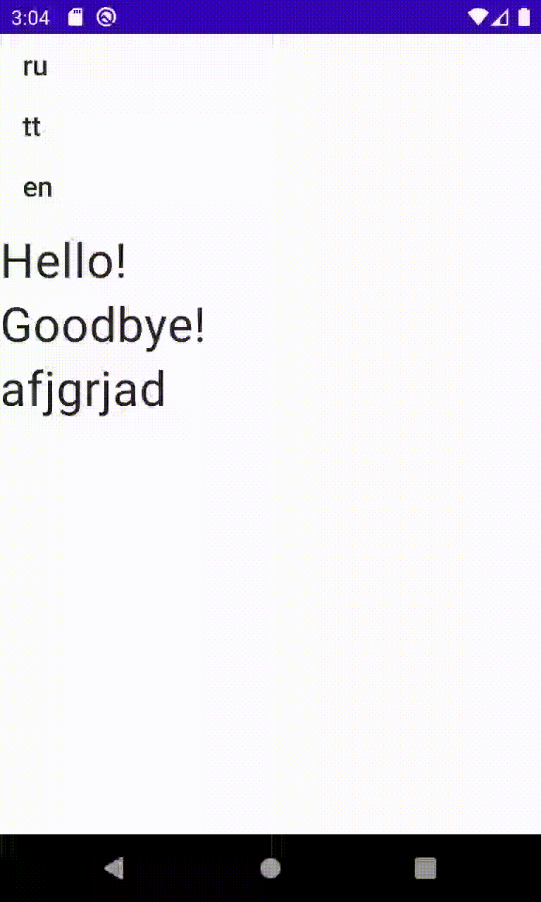

# Jetpack Compose Localization library  
  
Android XML-free string resources library with reactive locale changes

This library
-
- works without `android.content.Context` instance reference
- uses `CompositionLocal` (like `MaterialTheme`)
- changes locale reactively w/o headache of imperative view state management
- falls back to the default locale automatically
- has plurals support out of the box

TODO
-
- Setting up the default locale
- Preserving the default locale between restarts 
- Type-safety formatting (may be)
- Remove 'name' parameter from `(Non)Translatable`
- Interop with old Android XML resources
- String resource overriding in multi-module projects

Usage
-
**_Strings.kt_**
```kotlin
// create and register necessary locales
// English locale is registered by default
val RUSSIAN = Locale("ru")  
val TATAR = Locale("tt")  
  
val supportedLocalesNow = registerSupportedLocales(RUSSIAN, TATAR)

// 1st parameter name: id of a string, TODO remove
// 2nd parameter: string value for default localization
// 3rd parameter: closure that returns dictionary of locale to string resource
// hello is ext function that finds string in Localization receiver and returns it
val hello = Translatable(
    "hello",
    "Hello!",
    hashMapOf(
        RUSSIAN to "Привет!",
        TATAR to "Исәнме!"
    )
)
// non-translatable variant
val nonTrans = NonTranslatable("format", "%1\$d:%2\$02d")
```

**_Ui.kt_**
```kotlin
@Composable
fun Content() {
  Column {
    // Vocabulary - helper object for statical referencing on current Localization
    val localization = Vocabulary.localization  
    // call the defined function on the retrieved localization
    // that returns string in appropriate locale
    Text(text = localization.hello())
    // this string is always same
    Text(text = localization.nonTrans().format(20, 9))
  }
}
```

**_MainActivity.kt_**
```kotlin
setContent {
  val locale = remember { mutableStateOf(Locale.getDefault()) }  
  Localization(locale = locale.value) {
    Content()
  }
}
```
`locale` change leads on text translating in entire hierarchy

Sample
-


LICENSE
-
```
MIT License

Copyright (c) 2021 Technokratos

Permission is hereby granted, free of charge, to any person obtaining a copy
of this software and associated documentation files (the "Software"), to deal
in the Software without restriction, including without limitation the rights
to use, copy, modify, merge, publish, distribute, sublicense, and/or sell
copies of the Software, and to permit persons to whom the Software is
furnished to do so, subject to the following conditions:

The above copyright notice and this permission notice shall be included in all
copies or substantial portions of the Software.

THE SOFTWARE IS PROVIDED "AS IS", WITHOUT WARRANTY OF ANY KIND, EXPRESS OR
IMPLIED, INCLUDING BUT NOT LIMITED TO THE WARRANTIES OF MERCHANTABILITY,
FITNESS FOR A PARTICULAR PURPOSE AND NONINFRINGEMENT. IN NO EVENT SHALL THE
AUTHORS OR COPYRIGHT HOLDERS BE LIABLE FOR ANY CLAIM, DAMAGES OR OTHER
LIABILITY, WHETHER IN AN ACTION OF CONTRACT, TORT OR OTHERWISE, ARISING FROM,
OUT OF OR IN CONNECTION WITH THE SOFTWARE OR THE USE OR OTHER DEALINGS IN THE
SOFTWARE.
```